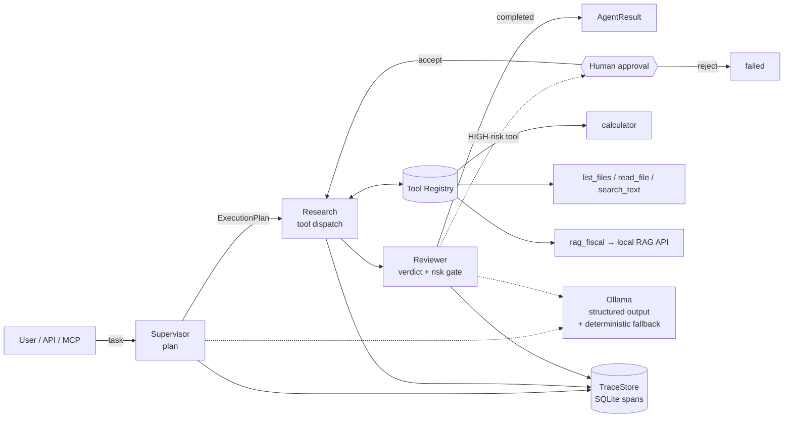

# Local Agent Orchestrator

> A **local-first agent runtime** — not a chatbot. It turns a natural-language task
> into a structured plan, executes tools with risk-gated **human-in-the-loop**
> approval, and records every step as an inspectable trace. Runs **100 % offline**
> on a local Ollama model, with a deterministic fallback so it never needs cloud
> quota to function.

<!-- screenshot: docs/screenshots/runs-light.png — runs list (light) -->

## What it is

Most "AI projects" are a prompt wrapped around a chat box. This is the layer
underneath an agent product: a **supervisor → specialists → reviewer** pipeline
(built on LangGraph) with a typed **tool registry**, a SQLite **trace store**, and
an **approval gate** that stops high-risk tool calls until a human signs off. A
FastAPI service exposes it over HTTP (+ Server-Sent Events for live progress and an
**MCP** endpoint), and a premium Next.js UI lets you launch runs, watch the span
tree fill in live, and approve/reject escalations.

It is the natural sequel to my [local RAG pipeline](../6-RAG): that project answers
one question over a document corpus; **this one treats that RAG service as a single
tool** (`rag_fiscal`) among others, and orchestrates multi-step tasks around it.
The story is **"from a RAG pipeline to an agent platform that consumes it."**

## Architecture



**Pipeline (LangGraph, 5 nodes):** `intake → plan → research → write → review`.
The planner emits a typed `ExecutionPlan` (via `instructor` structured output);
the research node dispatches each tool call through the registry; the reviewer
gates HIGH-risk tools and produces the final verdict. Every node and every tool
call is a **trace span** with parent/child links and latency.

## Why it matters

- **Tool use, done properly** — a typed `ToolRegistry` with per-tool **risk levels**
  (LOW/MEDIUM/HIGH), input/output/latency capture, and graceful error handling.
- **Human-in-the-loop** — HIGH-risk tools are **never executed** without explicit
  approval. The graph escalates to `approval_required`, persists an `ApprovalRequest`,
  and only runs the tool after an `accept` decision.
- **Observability** — every run is a tree of spans (SQLite), exportable as JSON and
  streamed live to the UI over SSE. You can see exactly what the agent did and how long it took.
- **Offline-first & quota-safe** — a deterministic fallback planner means the whole
  system (and its tests) runs with **zero LLM calls**. Set `FORCE_FALLBACK=true` and
  it still plans, executes tools, and escalates correctly.

## Eval

A 10-task **golden set** runs the real pipeline fully offline and checks
orchestration behaviour (tool routing, numeric correctness, offline-safe RAG,
HIGH-risk escalation, post-approval execution).

```bash
uv run --no-sync python eval/run_eval.py     # writes eval/report.json + eval/report.md
```

**Latest:** **10/10 passed (100 %)**, 10 tool calls dispatched, 1 human escalation,
orchestration overhead **median 0 ms** per task. Full report: [`eval/report.md`](eval/report.md).
(The two RAG-routed tasks include a real network round-trip to the — deliberately
down — RAG endpoint; that latency is environment-dependent, not orchestration cost.)

## Quickstart

**Prerequisites:** Python 3.11 + [`uv`](https://docs.astral.sh/uv/), Node 20+, and
(optionally) a local [Ollama](https://ollama.com) with `qwen3:1.7b-q4_K_M` pulled.
Without Ollama, set `FORCE_FALLBACK=true` and everything still runs.

```bash
# ── Backend (API on :8100) ──────────────────────────────────────────────
uv sync --extra dev --link-mode=copy
$env:PYTHONPATH = "src"                       # PowerShell; bash: export PYTHONPATH=src
uv run --no-sync uvicorn agent.api.main:app --port 8100 --reload
#   OpenAPI docs : http://localhost:8100/docs
#   MCP endpoint : http://localhost:8100/mcp

# ── Frontend (UI on :3000) ──────────────────────────────────────────────
cd frontend
npm install
npm run dev                                   # → http://localhost:3000
```

> **Reproducibility:** on a machine with internet access, run `npm install` once from
> `frontend/` so `@tailwindcss/postcss` is pinned in `package-lock.json` (the original dev
> environment had no network egress, so the lockfile could not be regenerated there).

**CLI** (no server needed):

```bash
uv run --no-sync agent run "Combien font 1850 × 12 ?"
uv run --no-sync agent runs list
uv run --no-sync agent runs show <run_id>
uv run --no-sync agent approve <run_id>
```

**Tests & lint** (never call a real model):

```bash
uv run --no-sync pytest -q        # 81 passed
uv run --no-sync ruff check .     # clean
```

## Tech stack

| Layer | Tech |
|---|---|
| Orchestration | LangGraph (5-node state graph) |
| LLM | Ollama (local) via `instructor` structured outputs + deterministic fallback |
| Schemas | Pydantic v2 (10 domain models) |
| Tools | Typed `ToolRegistry`, risk-gated, 5 built-ins (incl. `rag_fiscal`) |
| Persistence | SQLite trace store (parent/child spans, JSON export) |
| API | FastAPI — `/run`, `/runs`, `/runs/{id}`, `/approve`, `/health`, SSE `/stream`, MCP |
| UI | Next.js 15 (App Router) · TypeScript · Tailwind v4 · shadcn/ui · next-themes |

## Architecture HITL

The Human-in-the-Loop gate is a first-class node in the LangGraph pipeline, not
an afterthought bolted onto a tool. Every tool in the `ToolRegistry` carries a
`risk_level` (`LOW` / `MEDIUM` / `HIGH`), and **HIGH-risk tools are never
executed without an explicit human decision**. The two flagged tools out of the
box are `execute_bash` (arbitrary shell) and `delete_file` (destructive).

The flow is:

1. The **research** node dispatches a tool call. The reviewer (next node) checks
   the `risk_level` against the pending tool. If it is HIGH, the graph
   **short-circuits** before execution: the run transitions to the special
   `approval_required` status, the current `AgentState` is frozen, and an
   `ApprovalRequest` (run_id, tool name, args, planned span) is persisted to
   the SQLite trace store.
2. The backend surfaces this state over HTTP: `GET /runs/{id}` returns
   `status: "approval_required"` together with the request payload, and a
   **Server-Sent Events** stream on `/runs/{id}/stream` holds the run open
   (heartbeats keep the connection alive, no span is closed).
3. The Next.js frontend polls `/runs/{id}` and, on seeing
   `approval_required`, renders the `<ApprovePanel />` component — a side
   panel showing the tool name, its arguments, the originating task, and the
   span that would be created. The user clicks **Approve** or **Reject**.
4. The frontend calls `POST /runs/{id}/approve` with a JSON body
   `{ "decision": "accept" | "reject", "note": "…" }`. The backend resumes
   the graph from the frozen state: on `accept` the HIGH-risk tool is
   dispatched and the rest of the plan runs; on `reject` the run is
   terminated with `status: "failed"` and a `rejected_by_human` reason.

The key invariant is that **the graph never auto-resumes**: the run stays in
`approval_required` indefinitely until a human decision arrives, and the
`ApprovePanel` is the only sanctioned way to deliver that decision. This
makes HITL reviewable in the trace (an `approval` span with the decision and
note), auditable via the run history, and replayable in tests without any
LLM calls (`FORCE_FALLBACK=true` exercises the exact same path).

## Lancement Local

The project is split in two processes: a **FastAPI backend** (port `8100`,
the agent runtime) and a **Next.js frontend** (port `3000`, the UI). Both
must be running for the full HITL demo (the CLI in the [Quickstart](#quickstart)
section above also works headless).

```bash
# ── Backend (API on http://127.0.0.1:8100) ───────────────────────────────
cd ~/projets/7-Agent-Local
uv sync --extra dev
uv run uvicorn src.agent.api.main:app --host 127.0.0.1 --port 8100
#   OpenAPI docs : http://127.0.0.1:8100/docs
#   MCP endpoint : http://127.0.0.1:8100/mcp
#   Healthcheck  : http://127.0.0.1:8100/health

# ── Frontend (UI on http://localhost:3000) ───────────────────────────────
cd ~/projets/7-Agent-Local/frontend
npm install
npm run dev
#   UI           : http://localhost:3000
```

The backend must be started **before** you submit a run from the UI — the
frontend talks to it over `127.0.0.1:8100` by default (override via
`NEXT_PUBLIC_API_URL` at build time if you change the port). The very first
`npm install` from `frontend/` requires internet access so the Tailwind v4
PostCSS plugin gets pinned in `package-lock.json`; subsequent runs are
fully offline.

## Configuration

All runtime knobs are read from environment variables (or a `.env` file at
the repo root, loaded by the backend on startup). None are required — every
variable has a safe default — but the six below are the ones you'll
actually touch.

| Variable          | Default                       | Purpose |
|-------------------|-------------------------------|---------|
| `OLLAMA_BASE_URL` | `http://localhost:11434`      | Endpoint of the local Ollama server used by `instructor` for structured-output planning and review. Ignored when `FORCE_FALLBACK=true`. |
| `OLLAMA_MODEL`    | `qwen3:1.7b-q4_K_M`           | Model name passed to Ollama. Any chat model with reliable JSON-mode works; the golden set in [`eval/`](eval/) was scored on `qwen3:1.7b-q4_K_M`. |
| `FORCE_FALLBACK`  | `false`                       | When `true`, the planner and reviewer skip Ollama entirely and use the deterministic offline planner. The full HITL flow, trace store, and tests still work — use this for CI and for machines with no GPU. |
| `AGENT_PORT`      | `8100`                        | Port the FastAPI backend binds to. The frontend's `NEXT_PUBLIC_API_URL` should point at it. |
| `TRACE_DB_PATH`   | `./data/traces.sqlite`        | Path to the SQLite trace store. Each run, span, and `ApprovalRequest` is persisted here; export via the `/runs/{id}/trace` endpoint. |
| `RAG_API_URL`     | `http://127.0.0.1:8000`       | URL of the companion local RAG service (project `6-RAG`) consumed by the `rag_fiscal` tool. The agent degrades gracefully when it is down — the tool call is recorded as `unavailable` and the run continues. |

A minimal `.env` to run **fully offline** (no Ollama, no RAG service) is
simply:

```dotenv
FORCE_FALLBACK=true
```

## Screenshots

| | Light | Dark |
|---|---|---|
| Runs list | `docs/screenshots/runs-light.png` | `docs/screenshots/runs-dark.png` |
| New run dialog | `docs/screenshots/new-run-light.png` | `docs/screenshots/new-run-dark.png` |
| Run detail — result + tool output | `docs/screenshots/detail-result-light.png` | `docs/screenshots/detail-result-dark.png` |
| Run detail — span trace tree | `docs/screenshots/detail-trace-light.png` | `docs/screenshots/detail-trace-dark.png` |
| Approval panel (HIGH-risk) | `docs/screenshots/approval-light.png` | `docs/screenshots/approval-dark.png` |
| Offline banner | `docs/screenshots/offline-light.png` | `docs/screenshots/offline-dark.png` |

## More

- [Case study](docs/CASE_STUDY.md) — problem, architecture, the engineering decision I'm proudest of, eval numbers.
- [Demo script](docs/DEMO_SCRIPT.md) — a < 3-minute walkthrough.
- [Companion RAG project](../6-RAG) — the local RAG pipeline exposed here as the `rag_fiscal` tool.
