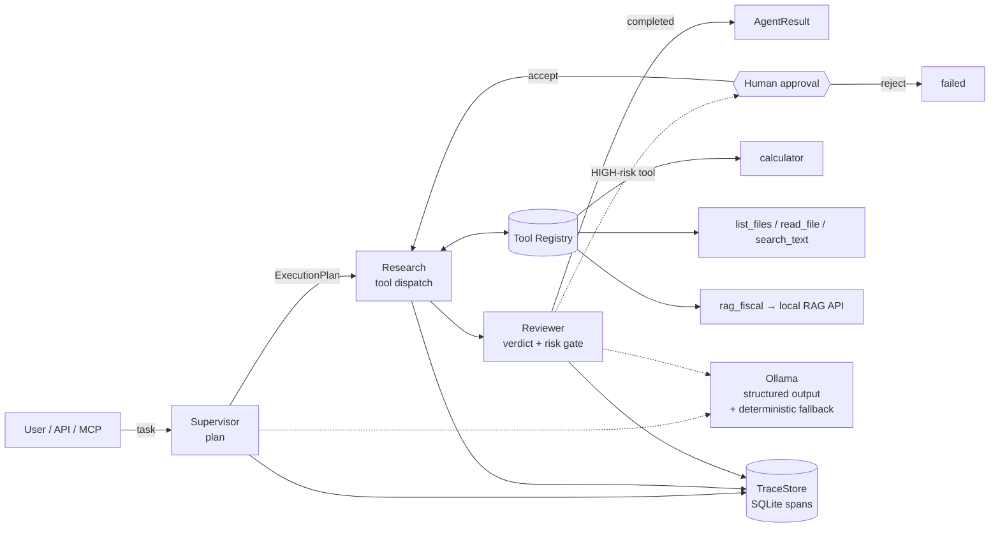

# Local Agent Orchestrator

> A **local-first agent runtime** — not a chatbot. It turns a natural-language task
> into a structured plan, executes tools with risk-gated **human-in-the-loop**
> approval, and records every step as an inspectable trace. Runs **100 % offline**
> on a local Ollama model, with a deterministic fallback so it never needs cloud
> quota to function.

<!-- screenshot: docs/screenshots/runs-light.png — runs list (light) -->

## What it is

Most "AI projects" are a prompt wrapped around a chat box. This is the layer
underneath an agent product: a **supervisor → specialists → reviewer** pipeline
(built on LangGraph) with a typed **tool registry**, a SQLite **trace store**, and
an **approval gate** that stops high-risk tool calls until a human signs off. A
FastAPI service exposes it over HTTP (+ Server-Sent Events for live progress and an
**MCP** endpoint), and a premium Next.js UI lets you launch runs, watch the span
tree fill in live, and approve/reject escalations.

It is the natural sequel to my [local RAG pipeline](../6-RAG): that project answers
one question over a document corpus; **this one treats that RAG service as a single
tool** (`rag_fiscal`) among others, and orchestrates multi-step tasks around it.
The story is **"from a RAG pipeline to an agent platform that consumes it."**

## Architecture



**Pipeline (LangGraph, 5 nodes):** `intake → plan → research → write → review`.
The planner emits a typed `ExecutionPlan` (via `instructor` structured output);
the research node dispatches each tool call through the registry; the reviewer
gates HIGH-risk tools and produces the final verdict. Every node and every tool
call is a **trace span** with parent/child links and latency.

## Why it matters

- **Tool use, done properly** — a typed `ToolRegistry` with per-tool **risk levels**
  (LOW/MEDIUM/HIGH), input/output/latency capture, and graceful error handling.
- **Human-in-the-loop** — HIGH-risk tools are **never executed** without explicit
  approval. The graph escalates to `approval_required`, persists an `ApprovalRequest`,
  and only runs the tool after an `accept` decision.
- **Observability** — every run is a tree of spans (SQLite), exportable as JSON and
  streamed live to the UI over SSE. You can see exactly what the agent did and how long it took.
- **Offline-first & quota-safe** — a deterministic fallback planner means the whole
  system (and its tests) runs with **zero LLM calls**. Set `FORCE_FALLBACK=true` and
  it still plans, executes tools, and escalates correctly.

## Eval

A 10-task **golden set** runs the real pipeline fully offline and checks
orchestration behaviour (tool routing, numeric correctness, offline-safe RAG,
HIGH-risk escalation, post-approval execution).

```bash
uv run --no-sync python eval/run_eval.py     # writes eval/report.json + eval/report.md
```

**Latest:** **10/10 passed (100 %)**, 10 tool calls dispatched, 1 human escalation,
orchestration overhead **median 0 ms** per task. Full report: [`eval/report.md`](eval/report.md).
(The two RAG-routed tasks include a real network round-trip to the — deliberately
down — RAG endpoint; that latency is environment-dependent, not orchestration cost.)

## Quickstart

**Prerequisites:** Python 3.11 + [`uv`](https://docs.astral.sh/uv/), Node 20+, and
(optionally) a local [Ollama](https://ollama.com) with `qwen3:1.7b-q4_K_M` pulled.
Without Ollama, set `FORCE_FALLBACK=true` and everything still runs.

```bash
# ── Backend (API on :8100) ──────────────────────────────────────────────
uv sync --extra dev --link-mode=copy
$env:PYTHONPATH = "src"                       # PowerShell; bash: export PYTHONPATH=src
uv run --no-sync uvicorn agent.api.main:app --port 8100 --reload
#   OpenAPI docs : http://localhost:8100/docs
#   MCP endpoint : http://localhost:8100/mcp

# ── Frontend (UI on :3000) ──────────────────────────────────────────────
cd frontend
npm install
npm run dev                                   # → http://localhost:3000
```

**CLI** (no server needed):

```bash
uv run --no-sync agent run "Combien font 1850 × 12 ?"
uv run --no-sync agent runs list
uv run --no-sync agent runs show <run_id>
uv run --no-sync agent approve <run_id>
```

**Tests & lint** (never call a real model):

```bash
uv run --no-sync pytest -q        # 81 passed
uv run --no-sync ruff check .     # clean
```

## Tech stack

| Layer | Tech |
|---|---|
| Orchestration | LangGraph (5-node state graph) |
| LLM | Ollama (local) via `instructor` structured outputs + deterministic fallback |
| Schemas | Pydantic v2 (10 domain models) |
| Tools | Typed `ToolRegistry`, risk-gated, 5 built-ins (incl. `rag_fiscal`) |
| Persistence | SQLite trace store (parent/child spans, JSON export) |
| API | FastAPI — `/run`, `/runs`, `/runs/{id}`, `/approve`, `/health`, SSE `/stream`, MCP |
| UI | Next.js 15 (App Router) · TypeScript · Tailwind v4 · shadcn/ui · next-themes |

## Screenshots

| | Light | Dark |
|---|---|---|
| Runs list | `docs/screenshots/runs-light.png` | `docs/screenshots/runs-dark.png` |
| New run dialog | `docs/screenshots/new-run-light.png` | `docs/screenshots/new-run-dark.png` |
| Run detail — result + tool output | `docs/screenshots/detail-result-light.png` | `docs/screenshots/detail-result-dark.png` |
| Run detail — span trace tree | `docs/screenshots/detail-trace-light.png` | `docs/screenshots/detail-trace-dark.png` |
| Approval panel (HIGH-risk) | `docs/screenshots/approval-light.png` | `docs/screenshots/approval-dark.png` |
| Offline banner | `docs/screenshots/offline-light.png` | `docs/screenshots/offline-dark.png` |

## More

- [Case study](docs/CASE_STUDY.md) — problem, architecture, the engineering decision I'm proudest of, eval numbers.
- [Demo script](docs/DEMO_SCRIPT.md) — a < 3-minute walkthrough.
- [Companion RAG project](../6-RAG) — the local RAG pipeline exposed here as the `rag_fiscal` tool.
