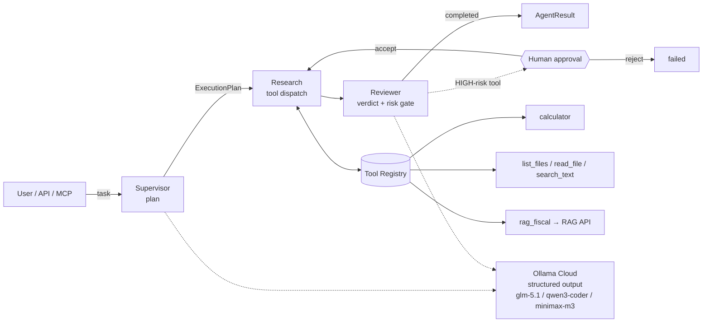

# Cloud-Only Agent Orchestrator

> A **cloud-powered agent runtime** — not a chatbot. It turns a natural-language task
> into a structured plan, executes tools with risk-gated **human-in-the-loop**
> approval, and records every step as an inspectable trace. All LLM calls go through
> **cloud models** (Ollama Cloud endpoint) via the OpenAI SDK + Instructor for
> structured outputs. A deterministic fallback exists **only for unit tests** (behind
> `FORCE_FALLBACK=true`), never in production.

## What it is

Most "AI projects" are a prompt wrapped around a chat box. This is the layer
underneath an agent product: a **supervisor → specialists → reviewer** pipeline
(built on LangGraph) with a typed **tool registry**, a SQLite **trace store**, and
an **approval gate** that stops high-risk tool calls until a human signs off. A
FastAPI service exposes it over HTTP (+ Server-Sent Events for live progress and an
**MCP** endpoint), and a Next.js UI lets you launch runs, watch the span tree fill
in live, and approve/reject escalations.

It is the natural sequel to my [local RAG pipeline](../6-RAG): that project answers
one question over a document corpus; **this one treats that RAG service as a single
tool** (`rag_fiscal`) among others, and orchestrates multi-step tasks around it.
The story is **"from a RAG pipeline to an agent platform that consumes it."**

## Architecture



**Pipeline (LangGraph, 5 nodes):** `intake → plan → research → write → review`.
The planner emits a typed `ExecutionPlan` (via `instructor` structured output);
the research node dispatches each tool call through the registry; the reviewer
gates HIGH-risk tools and produces the final verdict. Every node and every tool
call is a **trace span** with parent/child links and latency.

**Cloud models by role:**

| Role | Model | Purpose |
|---|---|---|
| Supervisor | `glm-5.1:cloud` | Planning, orchestration, high-level decisions |
| Coder | `qwen3-coder:480b-cloud` | Code generation, multi-file editing, tool calling |
| Researcher | `minimax-m3:cloud` | Web research, analysis, documentation, RAG |
| Reviewer | `glm-5.1:cloud` | Output validation, quality checks, verdicts |

## Why it matters

- **Tool use, done properly** — a typed `ToolRegistry` with per-tool **risk levels**
  (LOW/MEDIUM/HIGH), input/output/latency capture, and graceful error handling.
- **Human-in-the-loop** — HIGH-risk tools are **never executed** without explicit
  approval. The graph escalates to `approval_required`, persists an `ApprovalRequest`,
  and only runs the tool after an `accept` decision.
- **Observability** — every run is a tree of spans (SQLite), exportable as JSON and
  streamed live to the UI over SSE.
- **Cloud-only LLM** — all language model calls go through cloud models with the
  `:cloud` / `-cloud` suffix. The backend refuses to start if `REQUIRE_CLOUD_MODELS=true`
  and any configured model lacks the suffix. Errors are traced, never silently
  swallowed. A deterministic fallback exists **only for unit tests** via
  `FORCE_FALLBACK=true`.

## Eval

A 10-task **golden set** runs the real pipeline fully offline and checks
orchestration behaviour (tool routing, numeric correctness, offline-safe RAG,
HIGH-risk escalation, post-approval execution).

```bash
uv run --no-sync python eval/run_eval.py     # writes eval/report.json + eval/report.md
```

**Latest:** **10/10 passed (100 %)**, 10 tool calls dispatched, 1 human escalation.

## Quickstart

**Prerequisites:** Python 3.11+ + [`uv`](https://docs.astral.sh/uv/), Node 20+,
and an Ollama Cloud endpoint at `http://127.0.0.1:11434/v1`.

Without cloud models, set `FORCE_FALLBACK=true` (tests only — the backend will
not call any LLM and uses the deterministic planner).

```bash
# ── Backend (API on :8100) ──────────────────────────────────────────────
uv sync --extra dev --link-mode=copy
export PYTHONPATH=src
uv run --no-sync uvicorn agent.api.main:app --port 8100 --reload
#   OpenAPI docs : http://localhost:8100/docs
#   Healthcheck   : http://localhost:8100/health

# ── Frontend (UI on :3000) ──────────────────────────────────────────────
cd frontend
npm install
npm run dev                                   # → http://localhost:3000
```

> **Reproducibility:** on a machine with internet access, run `npm install` once from
> `frontend/` so `@tailwindcss/postcss` is pinned in `package-lock.json`.

**CLI** (no server needed):

```bash
uv run --no-sync agent run "Combien font 1850 × 12 ?"
uv run --no-sync agent runs list
uv run --no-sync agent runs show <run_id>
uv run --no-sync agent approve <run_id>
```

**Tests & lint** (never call a real model):

```bash
uv run --no-sync pytest -q
uv run --no-sync ruff check .
```

## Tech stack

| Layer | Tech |
|---|---|
| Orchestration | LangGraph (5-node state graph) |
| LLM | Ollama Cloud via OpenAI SDK + `instructor` structured outputs |
| Schemas | Pydantic v2 (10 domain models) |
| Tools | Typed `ToolRegistry`, risk-gated, 8 built-ins (incl. `rag_fiscal`) |
| Persistence | SQLite trace store (parent/child spans, JSON export) |
| API | FastAPI — `/run`, `/runs`, `/runs/{id}`, `/approve`, `/health`, SSE `/stream`, MCP |
| UI | Next.js 15 (App Router) · TypeScript · Tailwind v4 · shadcn/ui · next-themes |

## Architecture HITL

The Human-in-the-Loop gate is a first-class node in the LangGraph pipeline, not
an afterthought bolted onto a tool. Every tool in the `ToolRegistry` carries a
`risk_level` (`LOW` / `MEDIUM` / `HIGH`), and **HIGH-risk tools are never
executed without an explicit human decision**. The two flagged tools out of the
box are `execute_bash` (arbitrary shell) and `delete_file` (destructive).

The flow is:

1. The **research** node dispatches a tool call. The reviewer (next node) checks
   the `risk_level` against the pending tool. If it is HIGH, the graph
   **short-circuits** before execution: the run transitions to the special
   `approval_required` status, the current `AgentState` is frozen, and an
   `ApprovalRequest` (run_id, tool name, args, planned span) is persisted to
   the SQLite trace store.
2. The backend surfaces this state over HTTP: `GET /runs/{id}` returns
   `status: "approval_required"` together with the request payload, and a
   **Server-Sent Events** stream on `/runs/{id}/stream` holds the run open.
3. The Next.js frontend polls `/runs/{id}` and, on seeing
   `approval_required`, renders the `<ApprovePanel />` component. The user
   clicks **Approve** or **Reject**.
4. The frontend calls `POST /runs/{id}/approve` with a JSON body
   `{ "decision": "accept" | "reject", "note": "…" }`. The backend resumes
   the graph from the frozen state.

## Launch

The project is split in two processes: a **FastAPI backend** (port `8100`,
the agent runtime) and a **Next.js frontend** (port `3000`, the UI). Both
must be running for the full HITL demo.

```bash
# ── Backend (API on http://127.0.0.1:8100) ───────────────────────────────
cd ~/projets/7-Agent-Local
uv sync --extra dev
uv run uvicorn src.agent.api.main:app --host 127.0.0.1 --port 8100
#   OpenAPI docs : http://127.0.0.1:8100/docs
#   Healthcheck  : http://127.0.0.1:8100/health

# ── Frontend (UI on http://localhost:3000) ───────────────────────────────
cd ~/projets/7-Agent-Local/frontend
npm install
npm run dev
```

## Configuration

All runtime knobs are read from environment variables (or a `.env` file at the
repo root). See [`.env.example`](.env.example) for the full list.

| Variable | Default | Purpose |
|---|---|---|
| `OLLAMA_BASE_URL` | `http://127.0.0.1:11434/v1` | OpenAI-compatible endpoint for cloud models |
| `SUPERVISOR_MODEL` | `glm-5.1:cloud` | Model for supervisor role (planning) |
| `CODER_MODEL` | `qwen3-coder:480b-cloud` | Model for coder role (code generation) |
| `RESEARCHER_MODEL` | `minimax-m3:cloud` | Model for researcher role (analysis, RAG) |
| `REVIEWER_MODEL` | `glm-5.1:cloud` | Model for reviewer role (validation) |
| `REQUIRE_CLOUD_MODELS` | `true` | Refuse startup if any model lacks `:cloud`/`-cloud` suffix |
| `CLOUD_VALIDATION_DISABLED` | `false` | Skip model suffix validation entirely (CI/testing) |
| `FORCE_FALLBACK` | `false` | Use deterministic planner instead of LLM calls (tests only) |
| `AGENT_PORT` | `8100` | FastAPI backend port |
| `RAG_API_URL` | `http://127.0.0.1:8000` | URL of the companion RAG service |
| `CLOUD_API_KEY` | `ollama` | API key for the cloud endpoint |

A minimal `.env` to run **with cloud models**:

```dotenv
OLLAMA_BASE_URL=http://127.0.0.1:11434/v1
SUPERVISOR_MODEL=glm-5.1:cloud
CODER_MODEL=qwen3-coder:480b-cloud
RESEARCHER_MODEL=minimax-m3:cloud
REVIEWER_MODEL=glm-5.1:cloud
REQUIRE_CLOUD_MODELS=true
FORCE_FALLBACK=false
```

A minimal `.env` to run **tests without any LLM**:

```dotenv
FORCE_FALLBACK=true
CLOUD_VALIDATION_DISABLED=true
```

## Screenshots

| | Light | Dark |
|---|---|---|
| Runs list | `docs/screenshots/runs-light.png` | `docs/screenshots/runs-dark.png` |
| New run dialog | `docs/screenshots/new-run-light.png` | `docs/screenshots/new-run-dark.png` |
| Run detail — result + tool output | `docs/screenshots/detail-result-light.png` | `docs/screenshots/detail-result-dark.png` |
| Run detail — span trace tree | `docs/screenshots/detail-trace-light.png` | `docs/screenshots/detail-trace-dark.png` |
| Approval panel (HIGH-risk) | `docs/screenshots/approval-light.png` | `docs/screenshots/approval-dark.png` |

## More

- [Case study](docs/CASE_STUDY.md) — problem, architecture, the engineering decision I'm proudest of, eval numbers.
- [Demo script](docs/DEMO_SCRIPT.md) — a < 3-minute walkthrough.
- [Companion RAG project](../6-RAG) — the local RAG pipeline exposed here as the `rag_fiscal` tool.